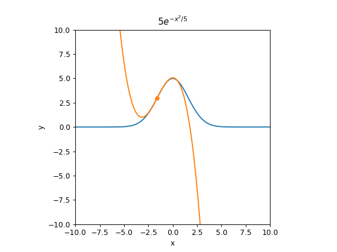

# Jupyter Notebook Class Demonstrations

   

A collection of interactive Jupyter Notebook mathematical demonstrations. This is meant as a follow-up to my [Mathematica Class Demonstrations](https://github.com/adam-rumpf/mathematica-class-demonstrations) project, remade using Jupyter Notebooks for ease of access.

_This is a work in progress. A full description of the project, along with links to the pages, will be added after a few preliminary demonstrations are complete._

## Table of Contents

* [Overview](#overview)
* [Calculus, Differential Equations, and Analysis](#calculus-differential-equations-and-analysis)
  * [Taylor Series Approximations](#taylor-series-approximations)

## Overview

This repository contains a collection of Jupyter Notebooks written for use as class aids. It is a continuation of my [Mathematica Class Demonstrations](https://github.com/adam-rumpf/mathematica-class-demonstrations) project, remade in a format that does not require the user to own any specialized software.

These notebooks are meant to act as standalone demonstrations that do not require any programming or technical knowledge on the part of the user. All of the links below are to standalone web app versions of the notebooks rendered using [Voilà](https://github.com/voila-dashboards/voila), meaning that the source code remains hidden and the page acts much like a textbook page with interactive widgets. If you wish to view or edit the source code while playing with the widgets you can use the [Binder](https://mybinder.org/) link at the top of this README.

## Calculus, Differential Equations, and Analysis

Many of the files in this folder are based on Mathematica demos originally written to show to my calculus students, either demonstrating material from class or demonstrating material from later classes that indirectly involve the concepts from basic calculus. In particular I find a lot of inspiration from dynamical systems, since they lend themselves quite well to visually demonstrating concepts from calculus.

### Taylor Series Approximations

 

Created 4/17/2021

[Complete Demonstration](https://mybinder.org/v2/gh/adam-rumpf/jupyter-class-demonstrations/HEAD?urlpath=voila%2Frender%2Fcalc-diffeq-analysis%2Ftaylor-series.ipynb)

[Standalone Widget](https://mybinder.org/v2/gh/adam-rumpf/jupyter-class-demonstrations/HEAD?urlpath=voila%2Frender%2Fcalc-diffeq-analysis%2Ftaylor-series-standalone.ipynb)

[Original Mathematica Demonstration](https://github.com/adam-rumpf/mathematica-class-demonstrations#taylor-and-fourier-series-approximations)

This demonstration shows how a [Taylor series](https://en.wikipedia.org/wiki/Taylor_series) approximation of a given function changes as more terms are added to the series. The complete demonstration includes a mini-lesson showing how the Taylor series can be arrived at by building up a sequence of increasingly-complicated polynomial approximations, while the standalone widget includes only the final widget for manipulating the center and degree of the approximation for a variety of test functions. These can be used to show how well the approximations model the original function near or far from the center, and how adding more terms changes things.
